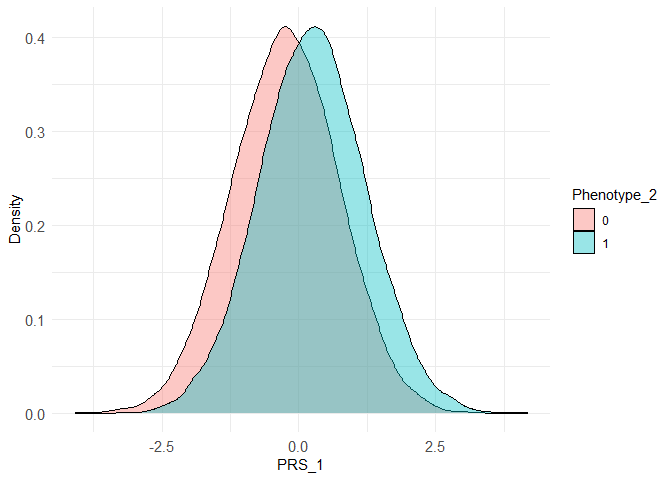
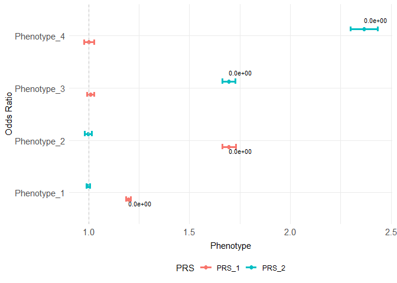
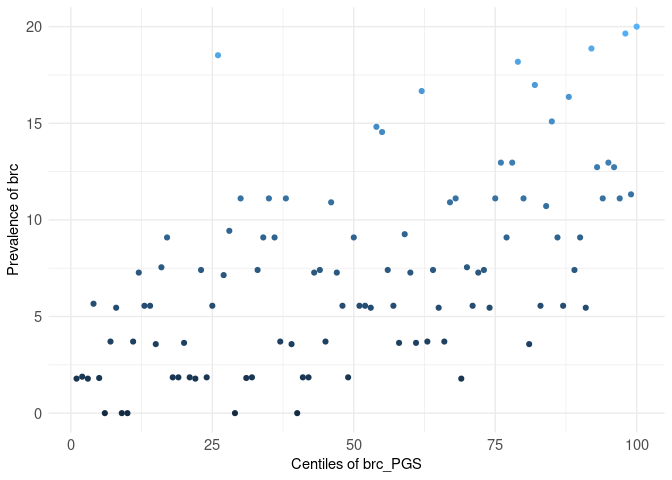
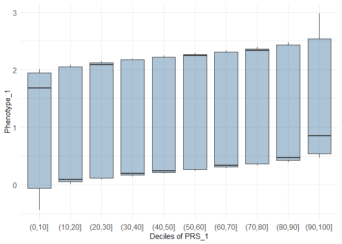

<!-- README.md is generated from README.Rmd. Please edit that file -->

# comorbidPRS

<!-- badges: start -->

[](https://github.com/VP-biostat/comorbidPRS)
<!-- badges: end -->

comorbidPRS is a tool for analysing an already computed PRS distribution
to investigate shared aetiology in multiple conditions.

comorbidPRS is under GPL-3 license, and is freely available for
download.

## Prerequisite

stats utils ggplot2 R version 3.5 or higher

## Installation

You can install the development version of comorbidPRS from
[GitHub](https://github.com/) with:

``` r
# install.packages("devtools")
devtools::install_github("VP-biostat/comorbidPRS")
```

## Example

### Building an Association Table

This is a basic example which shows you how to do basic association with
the example dataset:

``` r
library(comorbidPRS)

#use the demo dataset
dataset <- comorbidExample

#do an association of one PRS with one Phenotype
result_1 <- assoc(dataset, prs_col = "PRS_1", phenotype_col = "Phenotype_1")
```

| PRS   | Phenotype   | Covar | N_cases | N_controls |     N |       OR |        SE | lower_CI | upper_CI | P_value |
|:------|:------------|:------|:--------|:-----------|------:|---------:|----------:|---------:|---------:|--------:|
| PRS_1 | Phenotype_1 | NA    | NA      | NA         | 50000 | 1.197197 | 0.0044723 | 1.186749 | 1.207737 |       0 |

``` r
#do multiple associations
assoc <- expand.grid(c("PRS_1", "PRS_2"), c("Phenotype_1", "Phenotype_2", "Phenotype_3", "Phenotype_4"))
result_2 <- multiassoc(df = dataset, assoc_table = assoc, covar = c("Age", "Sex", "Covariate"))
```

| PRS   | Phenotype   | Covar             | N_cases | N_controls |     N |        OR |        SE |  lower_CI | upper_CI |   P_value |
|:------|:------------|:------------------|--------:|-----------:|------:|----------:|----------:|----------:|---------:|----------:|
| PRS_1 | Phenotype_1 | Age+Sex+Covariate |      NA |         NA | 50000 | 1.1971851 | 0.0044724 | 1.1867365 | 1.207726 | 0.0000000 |
| PRS_2 | Phenotype_1 | Age+Sex+Covariate |      NA |         NA | 50000 | 0.9988762 | 0.0045443 | 0.9900188 | 1.007813 | 0.8045741 |
| PRS_1 | Phenotype_2 | Age+Sex+Covariate |   24589 |      25411 | 50000 | 1.6967704 | 0.0098214 | 1.6644859 | 1.729818 | 0.0000000 |
| PRS_2 | Phenotype_2 | Age+Sex+Covariate |   24589 |      25411 | 50000 | 0.9972665 | 0.0089465 | 0.9799316 | 1.014908 | 0.7596387 |
| PRS_1 | Phenotype_3 | Age+Sex+Covariate |   25213 |      24787 | 50000 | 1.0086071 | 0.0089453 | 0.9910780 | 1.026447 | 0.3380300 |
| PRS_2 | Phenotype_3 | Age+Sex+Covariate |   25213 |      24787 | 50000 | 1.6947776 | 0.0098171 | 1.6625449 | 1.727772 | 0.0000000 |
| PRS_1 | Phenotype_4 | Age+Sex+Covariate |      NA |         NA | 50000 | 1.0019309 | 0.0127126 | 0.9772745 | 1.027210 | 0.8793929 |
| PRS_2 | Phenotype_4 | Age+Sex+Covariate |      NA |         NA | 50000 | 2.3658259 | 0.0146268 | 2.2991633 | 2.434845 | 0.0000000 |

### Examples of plot

``` r
densityplot(dataset, prs_col = "PRS_1", phenotype_col = "Phenotype_2")
```



``` r
#show multiple associations in a plot
orplot(score_table = result_2)
```



``` r
centileplot(dataset, prs_col = "PRS_2", phenotype_col = "Phenotype_3")
```



``` r
decileboxplot(dataset, prs_col = "PRS_1", phenotype_col = "Phenotype_1")
```



## Citation

If you use comorbidPRS in any published work, please cite the following
manuscript:

<p>
Pascat V (????). <em>comorbidPRS: Assessing the shared predisposition
between Phenotypes using Polygenic Scores (PRS)</em>. R package version
0.0.0.9000.
</p>
