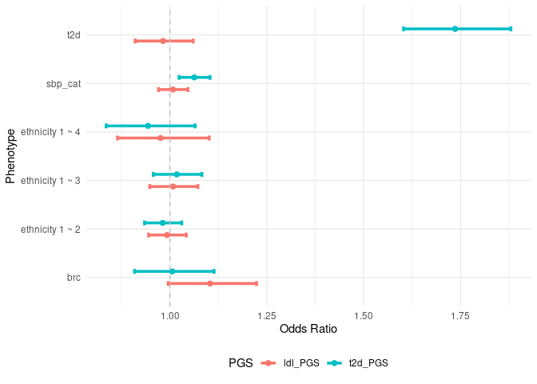

<!-- README.md is generated from README.Rmd. Please edit that file -->

# comorbidPGS

<!-- badges: start -->

[](https://github.com/VP-biostat/comorbidPGS)
[](https://cran.r-project.org/package=comorbidPGS)
<!-- badges: end -->

comorbidPGS is a tool for analysing an already computed Polygenic Score
(PGS, also named PRS/GRS for binary outcomes) distribution to
investigate shared genetic aetiology in multiple conditions.

comorbidPGS is under GPL-3 license, and is freely available for
download.

## Prerequisite

- R version 3.5 or higher with the following packages:
  - stats
  - utils
  - ggplot2

## Installation

comorbidPGS is available on CRAN, you can download it using the
following command:

``` r
install.packages("comorbidPGS")
```

If you prefer the latest stable development version, you can download it
from [GitHub](https://github.com/VP-biostat/comorbidPGS) with:

``` r
if (!require("devtools", quietly = TRUE)) install.packages("devtools")
devtools::install_github("VP-biostat/comorbidPGS")
```

## Example

### Building an Association Table of PGS

This is a basic example which shows you how to do basic association with
the example dataset:

``` r
library(comorbidPGS)
#> 
#> Attachement du package : 'comorbidPGS'
#> L'objet suivant est masqué depuis 'package:graphics':
#> 
#>     assocplot

# use the demo dataset
dataset <- comorbidData
# NOTE: The dataset must have at least 3 different columns:
# - an ID column (the first one)
# - a PGS column (must be numeric, by default it is the column named "SCORESUM" or the second column if "SCORESUM" is not present)
# - a Phenotype column, can be factors, numbers or characters

# do an association of one PGS with one Phenotype
result_1 <- assoc(dataset, prs_col = "t2d_PGS", phenotype_col = "t2d")
```

| PGS     | Phenotype | Phenotype_type | Statistical_method         | Covar | N_cases | N_controls |     N |   Effect | SE  | lower_CI | upper_CI | P_value |
|:--------|:----------|:---------------|:---------------------------|:------|--------:|-----------:|------:|---------:|:----|---------:|---------:|--------:|
| t2d_PGS | t2d       | Cases/Controls | Binary logistic regression | NA    |     730 |       9270 | 10000 | 1.688258 | NA  | 1.561821 | 1.824931 |       0 |

``` r
# do multiple associations
assoc <- expand.grid(c("t2d_PGS", "ldl_PGS"), c("ethnicity","brc","t2d","log_ldl","sbp_cat"))
result_2 <- multiassoc(df = dataset, assoc_table = assoc, covar = c("age", "sex", "gen_array"))
#> Warning in phenotype_type(df = df, phenotype_col = phenotype_col): Phenotype
#> column log_ldl is continuous and not normal, please normalise prior association

#> Warning in phenotype_type(df = df, phenotype_col = phenotype_col): Phenotype
#> column log_ldl is continuous and not normal, please normalise prior association
```

|     | PGS     | Phenotype       | Phenotype_type      | Statistical_method              | Covar             | N_cases | N_controls |     N |    Effect |        SE |  lower_CI |  upper_CI |   P_value |
|:----|:--------|:----------------|:--------------------|:--------------------------------|:------------------|--------:|-----------:|------:|----------:|----------:|----------:|----------:|----------:|
| 2   | t2d_PGS | ethnicity 1 ~ 2 | Categorical         | Multinomial logistic regression | age+sex+gen_array |    2142 |       6381 |  8523 | 0.9814174 |        NA | 0.9345150 | 1.0306739 | 0.4528020 |
| 3   | t2d_PGS | ethnicity 1 ~ 3 | Categorical         | Multinomial logistic regression | age+sex+gen_array |    1205 |       6381 |  7586 | 1.0178971 |        NA | 0.9570931 | 1.0825640 | 0.5724292 |
| 4   | t2d_PGS | ethnicity 1 ~ 4 | Categorical         | Multinomial logistic regression | age+sex+gen_array |     272 |       6381 |  6653 | 0.9434640 |        NA | 0.8355980 | 1.0652542 | 0.3474694 |
| 21  | ldl_PGS | ethnicity 1 ~ 2 | Categorical         | Multinomial logistic regression | age+sex+gen_array |    2142 |       6381 |  8523 | 0.9925623 |        NA | 0.9451678 | 1.0423334 | 0.7648927 |
| 31  | ldl_PGS | ethnicity 1 ~ 3 | Categorical         | Multinomial logistic regression | age+sex+gen_array |    1205 |       6381 |  7586 | 1.0083869 |        NA | 0.9481215 | 1.0724830 | 0.7905175 |
| 41  | ldl_PGS | ethnicity 1 ~ 4 | Categorical         | Multinomial logistic regression | age+sex+gen_array |     272 |       6381 |  6653 | 0.9760204 |        NA | 0.8647226 | 1.1016433 | 0.6943783 |
| 1   | t2d_PGS | brc             | Cases/Controls      | Binary logistic regression      | age+sex+gen_array |     402 |       5041 |  5443 | 1.0061678 |        NA | 0.9087543 | 1.1140235 | 0.9057882 |
| 11  | ldl_PGS | brc             | Cases/Controls      | Binary logistic regression      | age+sex+gen_array |     402 |       5041 |  5443 | 1.1037106 |        NA | 0.9956370 | 1.2235153 | 0.0605407 |
| 12  | t2d_PGS | t2d             | Cases/Controls      | Binary logistic regression      | age+sex+gen_array |     730 |       9270 | 10000 | 1.7359738 |        NA | 1.6029867 | 1.8799938 | 0.0000000 |
| 13  | ldl_PGS | t2d             | Cases/Controls      | Binary logistic regression      | age+sex+gen_array |     730 |       9270 | 10000 | 0.9823272 |        NA | 0.9102411 | 1.0601223 | 0.6465580 |
| 14  | t2d_PGS | log_ldl         | Continuous          | Linear regression               | age+sex+gen_array |      NA |         NA | 10000 | 0.0059961 | 0.0022747 | 0.0015378 | 0.0104544 | 0.0084010 |
| 15  | ldl_PGS | log_ldl         | Continuous          | Linear regression               | age+sex+gen_array |      NA |         NA | 10000 | 0.0828545 | 0.0021183 | 0.0787027 | 0.0870064 | 0.0000000 |
| 16  | t2d_PGS | sbp_cat         | Ordered Categorical | Ordinal logistic regression     | age+sex+gen_array |      NA |         NA | 10000 | 1.0628744 |        NA | 1.0236044 | 1.1036509 | 0.0015002 |
| 17  | ldl_PGS | sbp_cat         | Ordered Categorical | Ordinal logistic regression     | age+sex+gen_array |      NA |         NA | 10000 | 1.0078855 |        NA | 0.9707330 | 1.0464598 | 0.6818849 |

### Examples of data visualisation using comorbidPGS

``` r
densityplot(dataset, prs_col = "ldl_PGS", phenotype_col = "sbp_cat")
```


``` r
# show multiple associations in a plot
assoplot <- assocplot(score_table = result_2)
assoplot$continuous_phenotype
```


``` r
assoplot$discrete_phenotype
```

 NOTE: The
score_table should have the assoc() output format

``` r
centileplot(dataset, prs_col = "brc_PGS", phenotype_col = "brc")
#> Warning in centileplot(dataset, prs_col = "brc_PGS", phenotype_col = "brc"): The
#> dataset has less than 10,000 individuals, centiles plot may not look good! Use
#> the argument decile = TRUE to adapt to small datasets
```


As those graphical functions use ggplot2, you can fully customize your
plot:

``` r
library(ggplot2)
#> Warning: le package 'ggplot2' a été compilé avec la version R 4.2.3
centileplot(dataset, prs_col = "t2d_PGS", phenotype_col = "t2d") + 
  scale_color_gradient(low = "green", high = "red")
```


``` r
decileboxplot(dataset, prs_col = "ldl_PGS", phenotype_col = "ldl")
```


## Citation

To cite comorbidPGS in publications, please use:
<p>
Pascat V, Zudina L, Ulrich A, Maina JG, Kaakinen M, Pupko I, Bonnefond
A, Demirkan A, Balkhiyarova Z, Froguel P, Prokopenko I (2024).
“comorbidPGS: an R package assessing shared predisposition between
Phenotypes using Polygenic Scores.” <em>Human Heredity</em>.
<a href="https://doi.org/10.1159/000539325">doi:10.1159/000539325</a>.
</p>
