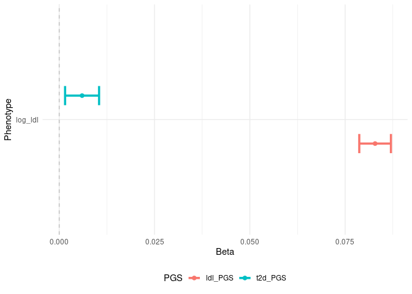

<!-- README.md is generated from README.Rmd. Please edit that file -->

# comorbidPRS

<!-- badges: start -->

[](https://github.com/VP-biostat/comorbidPRS)
<!-- badges: end -->

comorbidPRS is a tool for analysing an already computed PRS distribution
to investigate shared aetiology in multiple conditions.

comorbidPRS is under GPL-3 license, and is freely available for
download.

## Prerequisite

- R version 3.5 or higher with the following packages:
  - stats
  - utils
  - ggplot2

## Installation

You can install the development version of comorbidPRS from
[GitHub](https://github.com/VP-biostat/comorbidPRS) with:

``` r
# install.packages("devtools")
devtools::install_github("VP-biostat/comorbidPRS")
```

## Example

### Building an Association Table

This is a basic example which shows you how to do basic association with
the example dataset:

``` r
library(comorbidPRS)
#> 
#> Attachement du package : 'comorbidPRS'
#> L'objet suivant est masqué depuis 'package:graphics':
#> 
#>     assocplot

# use the demo dataset
dataset <- comorbidExample
# NOTE: The dataset must have at least 3 different columns:
# - an ID column (the first one)
# - a PRS column (must be numeric, by default it is the column named "SCORESUM" or the second column if "SCORESUM" is not present)
# - a Phenotype column, can be factors, numbers or characters

# do an association of one PRS with one Phenotype
result_1 <- assoc(dataset, prs_col = "PRS_1", phenotype_col = "Phenotype_1")
```

| PRS   | Phenotype   | Phenotype_Type | Covar | N_cases | N_controls |     N |   Effect |        SE | lower_CI | upper_CI | P_value |
|:------|:------------|:---------------|:------|:--------|:-----------|------:|---------:|----------:|---------:|---------:|--------:|
| PRS_1 | Phenotype_1 | Continuous     | NA    | NA      | NA         | 50000 | 1.991441 | 0.0268217 |  1.93887 | 2.044012 |       0 |

``` r
# do multiple associations
assoc <- expand.grid(c("PRS_1", "PRS_2"), c("Phenotype_1", "Phenotype_2", "Phenotype_3", "Phenotype_4"))
result_2 <- multiassoc(df = dataset, assoc_table = assoc, covar = c("Age", "Sex", "Covariate"))
```

| PRS   | Phenotype   | Phenotype_Type | Covar             | N_cases | N_controls |     N |     Effect |        SE |   lower_CI |  upper_CI |   P_value |
|:------|:------------|:---------------|:------------------|--------:|-----------:|------:|-----------:|----------:|-----------:|----------:|----------:|
| PRS_1 | Phenotype_1 | Continuous     | Age+Sex+Covariate |      NA |         NA | 50000 |  1.9914519 | 0.0268227 |  1.9388791 | 2.0440247 | 0.0000000 |
| PRS_2 | Phenotype_1 | Continuous     | Age+Sex+Covariate |      NA |         NA | 50000 | -0.0436724 | 0.0282645 | -0.0990712 | 0.0117264 | 0.1223206 |
| PRS_1 | Phenotype_2 | Cases/Controls | Age+Sex+Covariate |   24848 |      25152 | 50000 |  1.6649052 | 0.0097614 |  1.6334168 | 1.6971300 | 0.0000000 |
| PRS_2 | Phenotype_2 | Cases/Controls | Age+Sex+Covariate |   24848 |      25152 | 50000 |  1.0047871 | 0.0089457 |  0.9873235 | 1.0225602 | 0.5934457 |
| PRS_1 | Phenotype_3 | Cases/Controls | Age+Sex+Covariate |   25241 |      24759 | 50000 |  1.0212729 | 0.0089466 |  1.0035222 | 1.0393409 | 0.0186315 |
| PRS_2 | Phenotype_3 | Cases/Controls | Age+Sex+Covariate |   25241 |      24759 | 50000 |  1.6819537 | 0.0097941 |  1.6500382 | 1.7146199 | 0.0000000 |
| PRS_1 | Phenotype_4 | Categorical    | Age+Sex+Covariate |      NA |         NA | 50000 |  0.9998111 | 0.0003616 |  0.9991032 | 1.0005195 | 0.6014667 |
| PRS_2 | Phenotype_4 | Categorical    | Age+Sex+Covariate |      NA |         NA | 50000 |  1.0002051 | 0.0003675 |  0.9994851 | 1.0009259 | 0.5768392 |

### Examples of plot

``` r
densityplot(dataset, prs_col = "PRS_1", phenotype_col = "Phenotype_2")
```


``` r
# show multiple associations in a plot
assoplot <- assocplot(score_table = result_2)
assoplot$continuous_phenotype
```



``` r
assoplot$discrete_phenotype
```

 NOTE: The
score_table should have the assoc() output format

``` r
centileplot(dataset, prs_col = "PRS_2", phenotype_col = "Phenotype_3")
```


As those graphical functions use ggplot2, you can fully customize your
plot:

``` r
library(ggplot2)
centileplot(dataset, prs_col = "PRS_1", phenotype_col = "Phenotype_2") + 
  scale_color_gradient(low = "green", high = "red")
```


``` r
decileboxplot(dataset, prs_col = "PRS_1", phenotype_col = "Phenotype_1")
```


## Citation

If you use comorbidPRS in any published work, please cite the following
manuscript:

<p>
Pascat V (????). <em>comorbidPRS: Assessing the shared predisposition
between Phenotypes using Polygenic Scores (PRS)</em>. R package version
0.0.0.9000.
</p>
