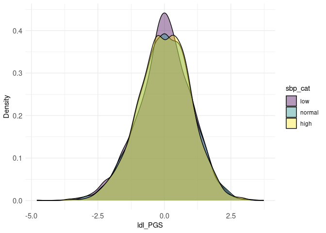

<!-- README.md is generated from README.Rmd. Please edit that file -->

# comorbidPRS

<!-- badges: start -->

[](https://github.com/VP-biostat/comorbidPRS)
<!-- badges: end -->

comorbidPRS is a tool for analysing an already computed PRS distribution
to investigate shared aetiology in multiple conditions.

comorbidPRS is under GPL-3 license, and is freely available for
download.

## Prerequisite

- R version 3.5 or higher with the following packages:
  - stats
  - utils
  - ggplot2

## Installation

You can install the development version of comorbidPRS from
[GitHub](https://github.com/VP-biostat/comorbidPRS) with:

``` r
# install.packages("devtools")
devtools::install_github("VP-biostat/comorbidPRS")
```

## Example

### Building an Association Table

This is a basic example which shows you how to do basic association with
the example dataset:

``` r
library(comorbidPRS)
#> 
#> Attachement du package : 'comorbidPRS'
#> L'objet suivant est masqué depuis 'package:graphics':
#> 
#>     assocplot

# use the demo dataset
dataset <- comorbidData
# NOTE: The dataset must have at least 3 different columns:
# - an ID column (the first one)
# - a PRS column (must be numeric, by default it is the column named "SCORESUM" or the second column if "SCORESUM" is not present)
# - a Phenotype column, can be factors, numbers or characters

# do an association of one PRS with one Phenotype
result_1 <- assoc(dataset, prs_col = "t2d_PRS", phenotype_col = "t2d")
```

| PRS     | Phenotype | Phenotype_type | Statistical_method         | Covar | N_cases | N_controls |     N |   Effect |        SE | lower_CI | upper_CI | P_value |
|:--------|:----------|:---------------|:---------------------------|:------|--------:|-----------:|------:|---------:|----------:|---------:|---------:|--------:|
| t2d_PRS | t2d       | Cases/Controls | Binary logistic regression | NA    |    2845 |      36535 | 39380 | 1.784127 | 0.0361516 | 1.713269 | 1.854984 |       0 |

``` r
# do multiple associations
assoc <- expand.grid(c("t2d_PRS", "ldl_PRS"), c("ethnicity","brc","t2d","log_ldl","sbp_cat"))
result_2 <- multiassoc(df = dataset, assoc_table = assoc, covar = c("age", "sex", "gen_array"))
#> Warning in phenotype_type(df = df, phenotype_col = phenotype_col): Phenotype
#> column log_ldl is continuous and not normal, please normalise prior association

#> Warning in phenotype_type(df = df, phenotype_col = phenotype_col): Phenotype
#> column log_ldl is continuous and not normal, please normalise prior association
```

|     | PRS     | Phenotype        | Phenotype_type      | Statistical_method              | Covar             | N_cases | N_controls |     N |    Effect |        SE |  lower_CI |  upper_CI |   P_value |
|:----|:--------|:-----------------|:--------------------|:--------------------------------|:------------------|--------:|-----------:|------:|----------:|----------:|----------:|----------:|----------:|
| 2   | t2d_PRS | ethnicity 1 \~ 2 | Categorical         | Multinomial logistic regression | age+sex+gen_array |    8526 |      24922 | 33448 | 0.9843528 | 0.0123519 | 0.9601431 | 1.0085625 | 0.2088171 |
| 3   | t2d_PRS | ethnicity 1 \~ 3 | Categorical         | Multinomial logistic regression | age+sex+gen_array |    4779 |      24922 | 29701 | 1.0161173 | 0.0160508 | 0.9846577 | 1.0475769 | 0.3114462 |
| 4   | t2d_PRS | ethnicity 1 \~ 4 | Categorical         | Multinomial logistic regression | age+sex+gen_array |    1153 |      24922 | 26075 | 1.0026245 | 0.0302145 | 0.9434041 | 1.0618450 | 0.9306895 |
| 21  | ldl_PRS | ethnicity 1 \~ 2 | Categorical         | Multinomial logistic regression | age+sex+gen_array |    8526 |      24922 | 33448 | 0.9925562 | 0.0124481 | 0.9681579 | 1.0169545 | 0.5513399 |
| 31  | ldl_PRS | ethnicity 1 \~ 3 | Categorical         | Multinomial logistic regression | age+sex+gen_array |    4779 |      24922 | 29701 | 1.0152907 | 0.0160504 | 0.9838319 | 1.0467496 | 0.3370977 |
| 41  | ldl_PRS | ethnicity 1 \~ 4 | Categorical         | Multinomial logistic regression | age+sex+gen_array |    1153 |      24922 | 26075 | 1.0128078 | 0.0305442 | 0.9529412 | 1.0726745 | 0.6730281 |
| 1   | t2d_PRS | brc              | Cases/Controls      | Binary logistic regression      | age+sex+gen_array |    1601 |      19867 | 21468 | 1.0348337 | 0.0269738 | 0.9819652 | 1.0877023 | 0.1889709 |
| 11  | ldl_PRS | brc              | Cases/Controls      | Binary logistic regression      | age+sex+gen_array |    1601 |      19867 | 21468 | 1.0119061 | 0.0263690 | 0.9602229 | 1.0635893 | 0.6496868 |
| 12  | t2d_PRS | t2d              | Cases/Controls      | Binary logistic regression      | age+sex+gen_array |    2845 |      36535 | 39380 | 1.8286147 | 0.0379141 | 1.7543029 | 1.9029264 | 0.0000000 |
| 13  | ldl_PRS | t2d              | Cases/Controls      | Binary logistic regression      | age+sex+gen_array |    2845 |      36535 | 39380 | 0.9968686 | 0.0196053 | 0.9584422 | 1.0352951 | 0.8732979 |
| 14  | t2d_PRS | log_ldl          | Continuous          | Linear regression               | age+sex+gen_array |      NA |         NA | 39380 | 0.0036203 | 0.0011515 | 0.0013633 | 0.0058773 | 0.0016686 |
| 15  | ldl_PRS | log_ldl          | Continuous          | Linear regression               | age+sex+gen_array |      NA |         NA | 39380 | 0.0843551 | 0.0010703 | 0.0822574 | 0.0864529 | 0.0000000 |
| 16  | t2d_PRS | sbp_cat          | Ordered Categorical | Ordinal logistic regression     | age+sex+gen_array |      NA |         NA | 39380 | 1.0757027 | 0.0013520 | 1.0730528 | 1.0783526 | 0.0000000 |
| 17  | ldl_PRS | sbp_cat          | Ordered Categorical | Ordinal logistic regression     | age+sex+gen_array |      NA |         NA | 39380 | 1.0754824 | 0.0013510 | 1.0728345 | 1.0781303 | 0.0000000 |

### Examples of plot

``` r
densityplot(dataset, prs_col = "ldl_PRS", phenotype_col = "sbp_cat")
```



``` r
# show multiple associations in a plot
assoplot <- assocplot(score_table = result_2)
assoplot$continuous_phenotype
```


``` r
assoplot$discrete_phenotype
```

 NOTE: The
score_table should have the assoc() output format

``` r
centileplot(dataset, prs_col = "brc_PRS", phenotype_col = "brc")
```


As those graphical functions use ggplot2, you can fully customize your
plot:

``` r
library(ggplot2)
centileplot(dataset, prs_col = "t2d_PRS", phenotype_col = "t2d") + 
  scale_color_gradient(low = "green", high = "red")
```


``` r
decileboxplot(dataset, prs_col = "ldl_PRS", phenotype_col = "ldl")
#> [1] 0
```


## Citation

If you use comorbidPRS in any published work, please cite the following
manuscript:

<p>
Pascat V (????). <em>comorbidPRS: Assessing the shared predisposition
between Phenotypes using Polygenic Scores (PRS)</em>. R package version
0.0.0.9000.
</p>
