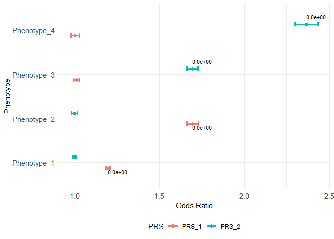

<!-- README.md is generated from README.Rmd. Please edit that file -->

# comorbidPRS

<!-- badges: start -->

[](https://github.com/VP-biostat/comorbidPRS)
<!-- badges: end -->

comorbidPRS is a tool for analysing an already computed PRS distribution
to investigate shared aetiology in multiple conditions.

comorbidPRS is under GPL-3 license, and is freely available for
download.

## Prerequisite

stats utils ggplot2 R version 3.5 or higher

## Installation

You can install the development version of comorbidPRS from
[GitHub](https://github.com/) with:

``` r
# install.packages("devtools")
devtools::install_github("VP-biostat/comorbidPRS")
```

## Example

This is a basic example which shows you how to do basic association with
the example dataset:

    #> 
    #> 
    #> ---
    #> Association testing:
    #>   PRS:  PRS_1
    #>   Phenotype:  Phenotype_1
    #>   Covariate:  NA
    #>   Phenotype type:  Continuous
    #>     Phenotype_1 ~ PRS_1
    #>   Sample Size:  50000
    #>    OR ( 95% CI ):  1.197197  ( 1.186749 - 1.207738 )
    #>    P-value:  0
    #>     PRS   Phenotype Covar N_cases N_controls     N       OR          SE
    #> 1 PRS_1 Phenotype_1    NA      NA         NA 50000 1.197197 0.004472266
    #>   lower_CI upper_CI P_value
    #> 1 1.186749 1.207738       0

    #> 
    #> 
    #> ------
    #> Multiple associations ( 8 ) testing:
    #>   |                                                                              |                                                                      |   0%
    #> 
    #> ---
    #> Association testing:
    #>   PRS:  PRS_1
    #>   Phenotype:  Phenotype_1
    #>   Covariate:  Age Sex Covariate
    #>   Phenotype type:  Continuous
    #>     Phenotype_1 ~ PRS_1 + Age + Sex + Covariate
    #>   Sample Size:  50000
    #>    OR ( 95% CI ):  1.197185  ( 1.186736 - 1.207726 )
    #>    P-value:  0 
    #> 
    #>   |                                                                              |=========                                                             |  12%
    #> 
    #> 
    #> ---
    #> Association testing:
    #>   PRS:  PRS_2
    #>   Phenotype:  Phenotype_1
    #>   Covariate:  Age Sex Covariate
    #>   Phenotype type:  Continuous
    #>     Phenotype_1 ~ PRS_2 + Age + Sex + Covariate
    #>   Sample Size:  50000
    #>    OR ( 95% CI ):  0.9988762  ( 0.9900188 - 1.007813 )
    #>    P-value:  0.8045741 
    #> 
    #>   |                                                                              |==================                                                    |  25%
    #> 
    #> 
    #> ---
    #> Association testing:
    #>   PRS:  PRS_1
    #>   Phenotype:  Phenotype_2
    #>   Covariate:  Age Sex Covariate
    #>   Phenotype type:  Cases/Controls
    #>     Phenotype_2 ~ PRS_1 + Age + Sex + Covariate
    #>   Cases:  24589
    #>   Controls:  25411
    #>   Sample Size:  50000
    #>    OR ( 95% CI ):  1.69677  ( 1.664486 - 1.729818 )
    #>    P-value:  0 
    #> 
    #>   |                                                                              |==========================                                            |  38%
    #> 
    #> 
    #> ---
    #> Association testing:
    #>   PRS:  PRS_2
    #>   Phenotype:  Phenotype_2
    #>   Covariate:  Age Sex Covariate
    #>   Phenotype type:  Cases/Controls
    #>     Phenotype_2 ~ PRS_2 + Age + Sex + Covariate
    #>   Cases:  24589
    #>   Controls:  25411
    #>   Sample Size:  50000
    #>    OR ( 95% CI ):  0.9972665  ( 0.9799316 - 1.014908 )
    #>    P-value:  0.7596387 
    #> 
    #>   |                                                                              |===================================                                   |  50%
    #> 
    #> 
    #> ---
    #> Association testing:
    #>   PRS:  PRS_1
    #>   Phenotype:  Phenotype_3
    #>   Covariate:  Age Sex Covariate
    #>   Phenotype type:  Cases/Controls
    #>     Phenotype_3 ~ PRS_1 + Age + Sex + Covariate
    #>   Cases:  25213
    #>   Controls:  24787
    #>   Sample Size:  50000
    #>    OR ( 95% CI ):  1.008607  ( 0.991078 - 1.026447 )
    #>    P-value:  0.33803 
    #> 
    #>   |                                                                              |============================================                          |  62%
    #> 
    #> 
    #> ---
    #> Association testing:
    #>   PRS:  PRS_2
    #>   Phenotype:  Phenotype_3
    #>   Covariate:  Age Sex Covariate
    #>   Phenotype type:  Cases/Controls
    #>     Phenotype_3 ~ PRS_2 + Age + Sex + Covariate
    #>   Cases:  25213
    #>   Controls:  24787
    #>   Sample Size:  50000
    #>    OR ( 95% CI ):  1.694778  ( 1.662545 - 1.727772 )
    #>    P-value:  0 
    #> 
    #>   |                                                                              |====================================================                  |  75%
    #> 
    #> 
    #> ---
    #> Association testing:
    #>   PRS:  PRS_1
    #>   Phenotype:  Phenotype_4
    #>   Covariate:  Age Sex Covariate
    #>   Phenotype type:  Categorical
    #>     Phenotype_4 ~ PRS_1 + Age + Sex + Covariate
    #>    Phenotype is categorical, 'cases' are interpreted as the factor not having the first level
    #>   Sample Size:  50000
    #>    OR ( 95% CI ):  1.001931  ( 0.9772745 - 1.02721 )
    #>    P-value:  0.8793929 
    #> 
    #>   |                                                                              |=============================================================         |  88%
    #> 
    #> 
    #> ---
    #> Association testing:
    #>   PRS:  PRS_2
    #>   Phenotype:  Phenotype_4
    #>   Covariate:  Age Sex Covariate
    #>   Phenotype type:  Categorical
    #>     Phenotype_4 ~ PRS_2 + Age + Sex + Covariate
    #>    Phenotype is categorical, 'cases' are interpreted as the factor not having the first level
    #>   Sample Size:  50000
    #>    OR ( 95% CI ):  2.365826  ( 2.299163 - 2.434845 )
    #>    P-value:  0 
    #> 
    #>   |                                                                              |======================================================================| 100%
    #>     PRS   Phenotype             Covar N_cases N_controls     N        OR
    #> 1 PRS_1 Phenotype_1 Age+Sex+Covariate      NA         NA 50000 1.1971851
    #> 2 PRS_2 Phenotype_1 Age+Sex+Covariate      NA         NA 50000 0.9988762
    #> 3 PRS_1 Phenotype_2 Age+Sex+Covariate   24589      25411 50000 1.6967704
    #> 4 PRS_2 Phenotype_2 Age+Sex+Covariate   24589      25411 50000 0.9972665
    #> 5 PRS_1 Phenotype_3 Age+Sex+Covariate   25213      24787 50000 1.0086071
    #> 6 PRS_2 Phenotype_3 Age+Sex+Covariate   25213      24787 50000 1.6947776
    #> 7 PRS_1 Phenotype_4 Age+Sex+Covariate      NA         NA 50000 1.0019309
    #> 8 PRS_2 Phenotype_4 Age+Sex+Covariate      NA         NA 50000 2.3658259
    #>            SE  lower_CI upper_CI   P_value
    #> 1 0.004472399 1.1867365 1.207726 0.0000000
    #> 2 0.004544322 0.9900188 1.007813 0.8045741
    #> 3 0.009821416 1.6644859 1.729818 0.0000000
    #> 4 0.008946462 0.9799316 1.014908 0.7596387
    #> 5 0.008945349 0.9910780 1.026447 0.3380300
    #> 6 0.009817085 1.6625449 1.727772 0.0000000
    #> 7 0.012712643 0.9772745 1.027210 0.8793929
    #> 8 0.014626835 2.2991633 2.434845 0.0000000

Examples of plot:




## Citation

If you use comorbidPRS in any published work, please cite the following
manuscript:

    #> Warning in citation("comorbidPRS"): no date field in DESCRIPTION file of package
    #> 'comorbidPRS'
    #> Warning in citation("comorbidPRS"): could not determine year for 'comorbidPRS'
    #> from package DESCRIPTION file

<p>
Pascat V (????). <em>comorbidPRS: Assessing the shared predisposition
between Phenotypes using Polygenic Scores (PRS)</em>. R package version
0.0.0.9000.
</p>
